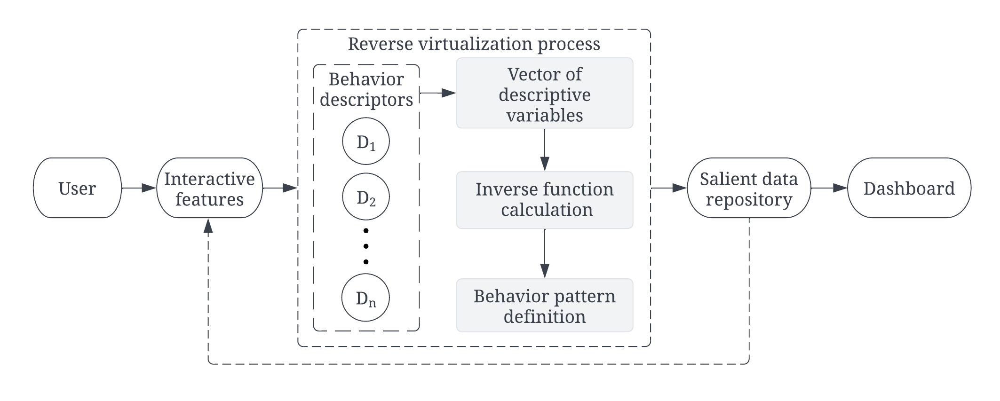
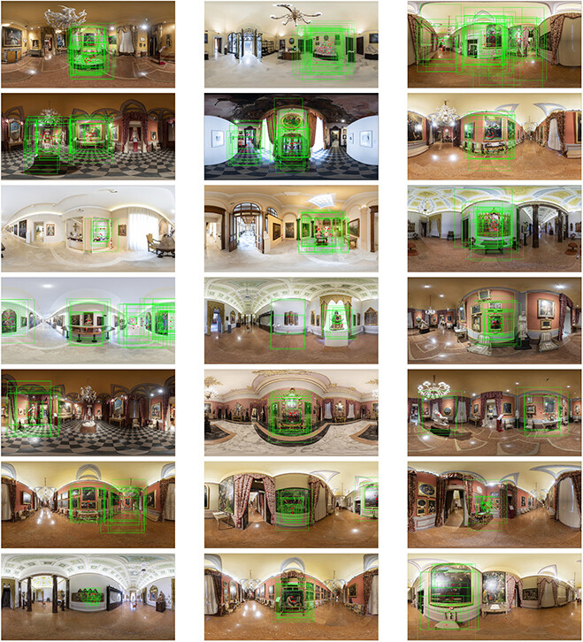

# 3VR: Vice Versa Virtual Reality Algorithm

**3VR** is a method for tracking, mapping, and analyzing user behavior in virtual panoramic environments. It captures how users explore 360-degree scenes and maps viewing activity onto regions of interest in equirectangular images.

The algorithm was originally developed and evaluated in a virtual panoramic museum, but the underlying approach is more general: it connects interaction logs, camera orientation, field of view, and spatial regions in panoramic projections. This makes it relevant for studying attention, movement, and behavioral patterns in immersive or simulated environments.

This repository contains public research code related to our published ACM paper:

Iva Vasic, Ramona Quattrini, Roberto Pierdicca, Adriano Mancini, and Bata Vasic. 2024. **3VR: Vice Versa Virtual Reality Algorithm to Track and Map User Experience**. *J. Comput. Cult. Herit.* 17, 3, Article 43 (September 2024). https://doi.org/10.1145/3656346

## Overview

3VR combines browser-side tracking with offline analysis scripts. During a virtual panoramic session, the system records viewing parameters and interaction data. The collected values are then processed to identify observed regions, user engagement patterns, and panorama-level behavior.

The MATLAB component processes exported tracking data and maps user activity back onto the equirectangular panorama space. This supports visualization and analysis of where users looked, how they navigated, and which spatial regions received attention.


**Research Questions:**

➡︎ *How consistently do people observe regions on the same panorama?*

➡︎ *How are observed regions distributed on the panorama?*

➡︎ *What features or contents on the panorama are prominent at the observed regions?*


<p align="center">
  
</p>

<p align="center">
  <em>Figure 1. The flowchart of the operations within our algorithm.</em>
</p>


## Results Example


<p align="center">
  
</p>

<p align="center">
  <em>Figure 2. Example of 3VR results and user behavior analysis.</em>
</p>


## What Is Not Included

This public version does **not** include:

- private Google Sheets collector scripts
- raw Excel/CSV tracking dataset
- panoramas
- a Pano2VR-generated runtime build

**Additional notes**
- `getCountryByIP.m` is included as a helper, but the IP geolocation API link should be updated before reuse.
- Some links are hidden for privacy reasons
- Data-related material would require additional preparation and normalization before any separate public release. **However, they can be provided upon request, subject to the approval of all five authors.**


## Citation

★★★ If you like and use this project, please cite our paper:

```bibtex
@article{10.1145/3656346,
author = {Vasic, Iva and Quattrini, Ramona and Pierdicca, Roberto and Mancini, Adriano and Vasic, Bata},
title = {3VR: Vice Versa Virtual Reality Algorithm to Track and Map User Experience},
year = {2024},
issue_date = {September 2024},
publisher = {Association for Computing Machinery},
address = {New York, NY, USA},
volume = {17},
number = {3},
issn = {1556-4673},
url = {https://doi.org/10.1145/3656346},
doi = {10.1145/3656346},
journal = {J. Comput. Cult. Herit.},
month = jun,
articleno = {43},
numpages = {19},
keywords = {User behavior, virtual reality, regions of interest, virtual museum}
}
```

## 🕹️ Live Demo

The browser demo is available at: https://ivavasic.github.io/3VR/docs/

Use `Start tracking` in the demo to begin recording viewpoint samples.

This demo is not part of the paper’s core analysis workflow. It is provided as an interactive companion to visualize and understand the 3VR coordinate mapping process, and as a foundation for future extensions.
